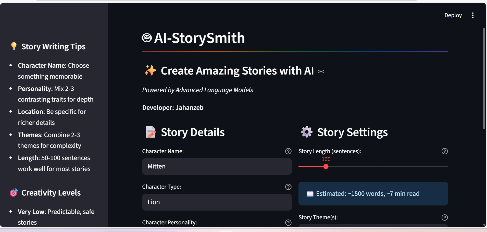
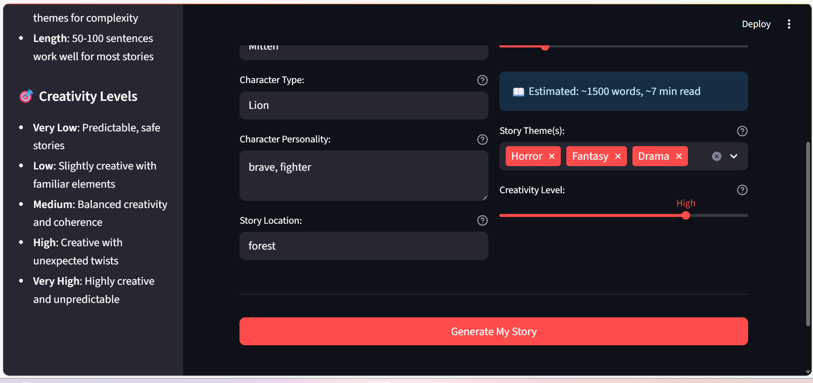
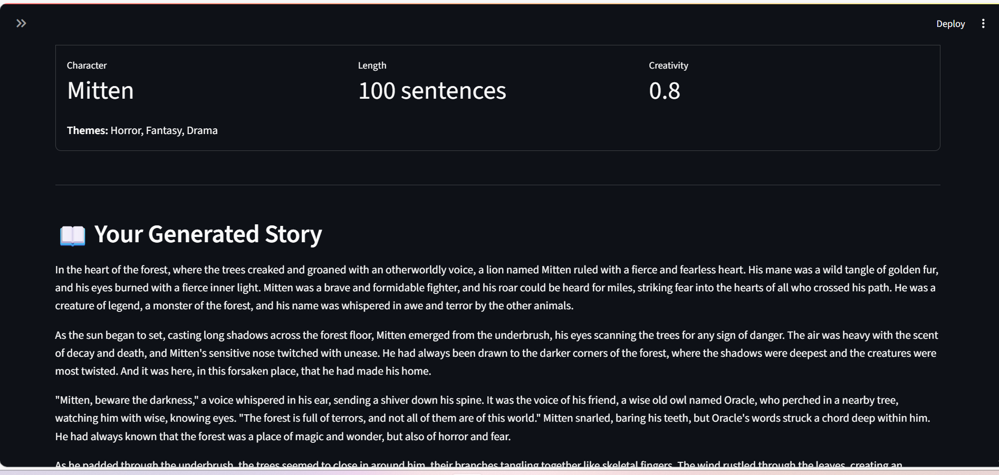

# AI-Storysmith-Gemini 🤖

An AI-powered web application that generates creative and unique stories based on user-defined inputs. This project features a FastAPI backend for story generation and a Streamlit frontend for an intuitive user experience, leveraging the power of the Groq API for rapid story creation.

## ✨ Features

- **Custom Story Generation**: Create engaging stories by providing details about your main character's name, type, personality, and location.
- **Theme Selection**: Choose from a variety of themes (e.g., Adventure, Sci-Fi, Mystery) to guide the story's direction.
- **Adjustable Creativity**: Control the story's unpredictability and creative flair by adjusting the creativity level via a temperature slider.
- **Real-time Generation**: Experience fast story generation powered by the high-speed Groq API.
- **User-Friendly Interface**: A simple and interactive UI built with Streamlit makes the process of creating a story easy and fun.

## 🚀 Technologies Used

- **Backend**:
  - [**Python**](https://www.python.org/)
  - [**FastAPI**](https://fastapi.tiangolo.com/) - Web framework for building the API.
  - [**LangChain**](https://www.langchain.com/) - Framework for developing applications powered by language models.
  - [**Pydantic**](https://pydantic-docs.helpmanual.io/) - Data validation and settings management.
  - [**Groq**](https://groq.com/) - Provides the high-performance LLM (Llama 3 70B) for story generation.

- **Frontend**:
  - [**Streamlit**](https://streamlit.io/) - A framework for building the web application UI.
  - [**Requests**](https://docs.python-requests.org/en/latest/) - Used to make API calls to the backend.

---

## 📸 Screenshots

Here are a few screenshots showcasing the application's user interface:

### The Story Input Form
A view of the main interface where users can enter character details and story settings.


### The Story Generation in Progress
This image shows the loading state while the AI is crafting the story.


### The Final Story
A screenshot of the generated story, complete with a download button.


---

## 🛠️ Installation and Setup

### Prerequisites

- Python 3.12
- A Groq API key (can be obtained from the Groq console).

1.  **Clone the repository:**
    ```bash
    git clone [https://github.com/jahanzeb/AI-Storysmith-Gemini.git](https://github.com/jahanzeb/AI-Storysmith-Gemini.git)
    cd AI-Storysmith-Gemini
    ```

2.  **Create a virtual environment:**
    ```bash
    python -m venv venv
    ```

3.  **Activate the virtual environment:**
    - On Windows:
      ```bash
      .\venv\Scripts\activate
      ```
    - On macOS/Linux:
      ```bash
      source venv/bin/activate
      ```

4.  **Install the required dependencies:**
    ```bash
    pip install -r requirements.txt
    ```
    *(Note: You'll need to create a `requirements.txt` file by running `pip freeze > requirements.txt`)*

5.  **Set up environment variables:**
    - Create a `.env` file in the root directory of your project.
    - Add your Groq API key to the file:
      ```
      GOOGLE_API_KEY="your_groq_api_key_here"
      ```

---

## ▶️ Usage

The application consists of a FastAPI backend and a Streamlit frontend. You need to run both concurrently.

1.  **Run the FastAPI Backend:**
    Navigate to the project's root directory and run the following command to start the API server:
    ```bash
    uvicorn api_utils:app --reload
    ```
    The API will be running on `http://127.0.0.1:8000`.

2.  **Run the Streamlit Frontend:**
    Open a new terminal, navigate to the project's root directory, and run the Streamlit application:
    ```bash
    streamlit run frontend.py
    ```
    This will open the web application in your default browser.

---

## 🗺️ Project Structure

Author Jahanzeb Riaz
